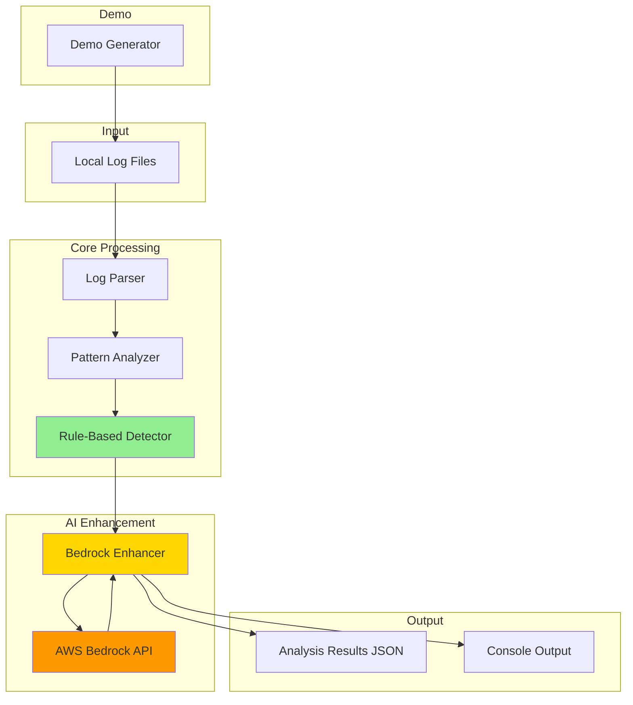
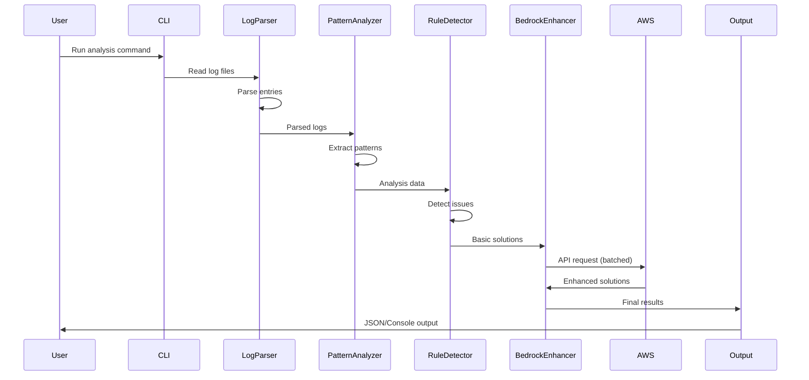
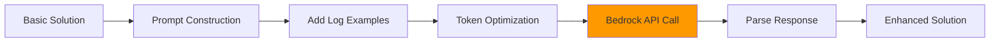

# Design Document: AI Log Analyzer với AWS Bedrock

## Overview

AI Log Analyzer là một standalone module phân tích logs sử dụng rule-based detection kết hợp với AWS Bedrock AI enhancement. Module đọc logs từ local files (giả lập logs từ CloudWatch), phân tích patterns, detect issues phổ biến, và generate enhanced solutions với detailed explanations.

### Key Features

- **Log Parsing**: Parse logs thành structured data (timestamp, severity, component, message)
- **Pattern Analysis**: Phân tích patterns, trends, và anomalies trong logs
- **Rule-Based Detection**: Detect 5 loại issues phổ biến (connection, permission, resource, database, security)
- **AI Enhancement**: Sử dụng AWS Bedrock Claude models để enhance solutions với detailed explanations
- **Demo Scenarios**: Generate realistic attack logs cho testing và demo
- **Cost Optimization**: Batching, sampling, và configurable limits để control AWS costs
- **Standalone Design**: Module hoàn toàn độc lập, output JSON để dễ integrate

### Target Users

- Developers mới học cloud (first cloud project)
- Students với budget hạn chế
- Teams cần AI-powered log analysis module

### Design Goals

1. **Simplicity**: Dễ hiểu, dễ setup, dễ sử dụng cho người mới
2. **Standalone**: Không phụ thuộc vào infrastructure phức tạp
3. **Cost-Effective**: Optimize AWS Bedrock costs cho student budget
4. **Demonstrable**: Demo flow hoàn chỉnh trong 5 phút
5. **Integrable**: Output format chuẩn để team khác integrate dễ dàng


## Architecture

### High-Level Architecture



### Data Flow



### Component Architecture

Module được chia thành 5 components chính:

1. **Log Parser**: Parse raw logs thành structured data
2. **Pattern Analyzer**: Analyze patterns và trends
3. **Rule-Based Detector**: Detect issues bằng predefined rules
4. **Bedrock Enhancer**: Enhance solutions với AWS Bedrock
5. **Demo Generator**: Generate sample logs cho testing


## Components and Interfaces

### 1. Log Parser

**Responsibility**: Parse raw log entries thành structured data

**Interface**:
```python
class LogParser:
    def parse_log_entry(self, line: str) -> LogEntry:
        """Parse a single log line into structured data"""
        pass
    
    def find_log_files(self, directory: str, max_files: int = 100) -> List[str]:
        """Find all .log files in directory recursively"""
        pass
    
    def search_files_for_term(self, files: List[str], term: str, 
                             max_matches: int = 1000) -> List[Match]:
        """Search files for specific term (case-insensitive)"""
        pass
```

**Key Functions**:
- Extract timestamp (ISO 8601 và common formats)
- Extract severity level (ERROR, INFO, WARNING, DEBUG, CRITICAL, WARN, FATAL)
- Extract component name (từ [component] hoặc "component:")
- Extract message content
- Handle encoding errors gracefully (utf-8 với errors='replace')

**Implementation Notes**:
- Sử dụng regex patterns cho timestamp và severity extraction
- Support multiple timestamp formats: ISO 8601, common log formats
- Component extraction từ brackets hoặc colon-separated prefix
- Recursive directory traversal với os.walk()
- File filtering theo .log extension


### 2. Pattern Analyzer

**Responsibility**: Analyze parsed logs để extract patterns và trends

**Interface**:
```python
class PatternAnalyzer:
    def analyze_log_entries(self, entries: List[Match]) -> AnalysisData:
        """Analyze log entries to extract patterns and insights"""
        pass
    
    def extract_error_patterns(self, errors: List[str]) -> List[ErrorPattern]:
        """Extract and normalize common error patterns"""
        pass
    
    def analyze_time_patterns(self, timestamps: List[str]) -> TimePattern:
        """Analyze temporal patterns in logs"""
        pass
```

**Key Functions**:
- Calculate severity distribution (count của mỗi severity level)
- Calculate component distribution (count của logs từ mỗi component)
- Analyze time patterns (first/last occurrence, total occurrences)
- Extract common error patterns bằng normalization:
  - Replace UUIDs với `<ID>`
  - Replace numbers với `<NUM>`
- Group similar error patterns và count occurrences
- Identify top 10 most common error patterns

**Implementation Notes**:
- Sử dụng Counter từ collections cho distribution calculations
- Regex patterns cho UUID và number normalization
- Sort timestamps để find first/last occurrence
- Pattern grouping bằng normalized strings


### 3. Rule-Based Detector

**Responsibility**: Detect issues dựa trên predefined rules và keywords

**Interface**:
```python
class RuleBasedDetector:
    def detect_issues(self, analysis: AnalysisData) -> List[Issue]:
        """Detect issues based on analysis data"""
        pass
    
    def classify_issue_type(self, patterns: List[str]) -> IssueType:
        """Classify issue type based on patterns"""
        pass
    
    def generate_basic_solution(self, issue: Issue) -> Solution:
        """Generate basic solution for detected issue"""
        pass
    
    def load_custom_rules(self, config_path: str) -> None:
        """Load custom detection rules from config file"""
        pass
```

**Detection Rules**:

| Issue Type | Keywords | Basic Solution |
|------------|----------|----------------|
| Connection | connection, timeout, connect | Check network connectivity, verify services running, check firewall/DNS |
| Permission | permission, access, denied | Verify file/resource permissions, check service account access rights |
| Resource | memory, cpu, capacity, full | Check system resources, consider scaling, optimize resource usage |
| Database | database, db, sql, query | Check DB connectivity, query performance, verify indices |
| Security | unauthorized, forbidden, authentication failed | Review authentication logs, check access policies, verify credentials |

**Implementation Notes**:
- Keyword matching trong error patterns (case-insensitive)
- Severity calculation dựa trên error count và pattern frequency
- Fallback logic: nếu không detect specific issue, identify component với most errors
- Support custom rules từ JSON config file
- Output structure: issue_type, severity, affected_components, basic_solution


### 4. Bedrock Enhancer

**Responsibility**: Enhance basic solutions với AWS Bedrock AI

**Interface**:
```python
class BedrockEnhancer:
    def __init__(self, region: str, model: str = "claude-3-haiku"):
        """Initialize Bedrock client with AWS credentials"""
        pass
    
    def enhance_solutions(self, solutions: List[Solution], 
                         log_examples: List[str]) -> List[EnhancedSolution]:
        """Enhance solutions with AI-generated detailed explanations"""
        pass
    
    def batch_enhance(self, solutions: List[Solution], 
                     batch_size: int = 5) -> List[EnhancedSolution]:
        """Batch process multiple solutions to optimize API calls"""
        pass
    
    def estimate_cost(self, prompt_tokens: int, 
                     completion_tokens: int) -> float:
        """Estimate cost for API call"""
        pass
    
    def is_available(self) -> bool:
        """Check if AWS credentials are configured"""
        pass
```

**AWS Bedrock Integration**:



**Prompt Engineering**:
```python
prompt_template = """Enhance this log analysis solution:

Problem: {problem}
Basic solution: {solution}

Log examples:
{log_examples}

Provide:
1. Detailed explanation of the root cause
2. Step-by-step resolution steps
3. Prevention recommendations
4. Related AWS best practices (if applicable)

Keep response concise and actionable."""
```


**AWS Configuration**:
- **Authentication**: boto3 với AWS credentials (AWS_ACCESS_KEY_ID, AWS_SECRET_ACCESS_KEY, AWS_REGION)
- **Models**: 
  - `claude-3-haiku` (default, cheaper, faster)
  - `claude-3-sonnet` (optional, more detailed)
- **Parameters**:
  - `temperature`: 0.3-0.5 (focused, deterministic responses)
  - `max_tokens`: 2000 (control response length và cost)
  - `timeout`: 30 seconds per request

**Cost Optimization**:
- Batch processing: max 5 solutions per API call
- Log examples limit: max 3 patterns per solution
- Sampling rate: configurable (default 100%)
- Cost threshold warning: default $1.00 per run
- Fallback to basic solution on API failure

**Error Handling**:
- Graceful degradation khi AWS credentials không available
- Retry logic với exponential backoff
- Handle throttling, quota exceeded, authentication errors
- Timeout handling với fallback to basic solution

**Implementation Notes**:
- Sử dụng boto3 Bedrock Runtime client
- Mark enhanced solutions với `ai_enhanced: true` flag
- Preserve original solution để có thể compare
- Log API usage: tokens used, estimated cost
- Cost tracking file: `costs.json` để track spending over time


### 5. Demo Generator

**Responsibility**: Generate realistic sample logs cho testing và demo

**Interface**:
```python
class DemoGenerator:
    def generate_attack_logs(self, scenario: str, 
                            num_logs: int = 1000) -> List[str]:
        """Generate logs for specific attack scenario"""
        pass
    
    def generate_normal_logs(self, num_logs: int = 500) -> List[str]:
        """Generate normal traffic logs"""
        pass
    
    def mix_logs(self, attack_logs: List[str], 
                normal_logs: List[str], ratio: float = 0.3) -> List[str]:
        """Mix attack and normal logs with specified ratio"""
        pass
    
    def write_to_files(self, logs: List[str], 
                      output_dir: str = "data/logs/demo") -> None:
        """Write logs to files in directory structure"""
        pass
```

**Attack Scenarios**:

1. **SQL Injection**:
   - Pattern: Multiple failed queries với SQL syntax trong parameters
   - Components: web-server, database
   - Severity: ERROR, CRITICAL

2. **Brute Force Login**:
   - Pattern: Multiple authentication failures từ same IP
   - Components: auth-service
   - Severity: WARNING, ERROR

3. **DDoS Attack**:
   - Pattern: High volume requests trong short time
   - Components: api-gateway, web-server
   - Severity: WARNING, ERROR

4. **Unauthorized Access**:
   - Pattern: Access denied errors, permission failures
   - Components: auth-service, api-gateway
   - Severity: WARNING, ERROR

**Log Format**:
```
2024-01-15T10:30:45.123Z ERROR [web-server] SQL injection attempt detected: SELECT * FROM users WHERE id='1' OR '1'='1'
2024-01-15T10:30:46.234Z WARNING [auth-service] Failed login attempt for user admin from IP 192.168.1.100
2024-01-15T10:30:47.345Z INFO [api-gateway] Request processed successfully: GET /api/users
```

**Implementation Notes**:
- Generate timestamps với realistic time patterns (clustered for attacks)
- Mix severity levels: 60% ERROR, 30% WARNING, 10% INFO
- Include normal traffic: 70% normal, 30% attack logs
- Multiple components: web-server, database, auth-service, api-gateway
- Configurable parameters: num_logs, attack_intensity, time_range
- Cleanup script để xóa demo data


## Data Models

### LogEntry

Structured representation của một log line:

```python
@dataclass
class LogEntry:
    raw: str                    # Original log line
    timestamp: Optional[str]    # ISO 8601 hoặc common format
    severity: str               # ERROR, INFO, WARNING, DEBUG, CRITICAL, WARN, FATAL
    component: Optional[str]    # Component name (từ [component] hoặc "component:")
    message: str                # Message content sau khi remove metadata
```

**Example**:
```python
LogEntry(
    raw="2024-01-15T10:30:45.123Z ERROR [web-server] Connection timeout to database",
    timestamp="2024-01-15T10:30:45.123Z",
    severity="ERROR",
    component="web-server",
    message="Connection timeout to database"
)
```

### Match

Representation của một log entry match:

```python
@dataclass
class Match:
    file: str           # File path
    line_number: int    # Line number trong file
    content: str        # Log line content
```


### ErrorPattern

Normalized error pattern với occurrence count:

```python
@dataclass
class ErrorPattern:
    component: str      # Component where error occurred
    pattern: str        # Normalized pattern (UUIDs -> <ID>, numbers -> <NUM>)
    count: int          # Number of occurrences
    examples: List[str] # Original error messages (max 3)
```

**Example**:
```python
ErrorPattern(
    component="database",
    pattern="Connection timeout after <NUM> seconds to host <ID>",
    count=15,
    examples=[
        "Connection timeout after 30 seconds to host db-prod-01",
        "Connection timeout after 30 seconds to host db-prod-02"
    ]
)
```

### AnalysisData

Aggregated analysis results:

```python
@dataclass
class AnalysisData:
    total_entries: int
    severity_distribution: Dict[str, int]  # {severity: count}
    components: Dict[str, int]             # {component: count}
    time_pattern: Optional[TimePattern]
    error_patterns: List[ErrorPattern]     # Top 10 most common
```

**Example**:
```python
AnalysisData(
    total_entries=1500,
    severity_distribution={"ERROR": 450, "WARNING": 300, "INFO": 750},
    components={"web-server": 600, "database": 400, "auth-service": 500},
    time_pattern=TimePattern(
        first_occurrence="2024-01-15T10:00:00Z",
        last_occurrence="2024-01-15T11:00:00Z",
        total_occurrences=1500
    ),
    error_patterns=[...]
)
```


### Issue

Detected issue với classification:

```python
@dataclass
class Issue:
    issue_type: IssueType       # connection, permission, resource, database, security
    severity: str               # HIGH, MEDIUM, LOW
    affected_components: List[str]
    error_count: int
    patterns: List[ErrorPattern]
```

**IssueType Enum**:
```python
class IssueType(Enum):
    CONNECTION = "connection"
    PERMISSION = "permission"
    RESOURCE = "resource"
    DATABASE = "database"
    SECURITY = "security"
    UNKNOWN = "unknown"
```

### Solution

Basic solution từ rule-based detector:

```python
@dataclass
class Solution:
    problem: str                # Problem description
    solution: str               # Basic solution text
    issue_type: IssueType
    affected_components: List[str]
```

### EnhancedSolution

AI-enhanced solution từ Bedrock:

```python
@dataclass
class EnhancedSolution:
    problem: str
    solution: str               # Enhanced solution text
    original_solution: str      # Basic solution (preserved)
    ai_enhanced: bool           # True if enhanced by AI
    issue_type: IssueType
    affected_components: List[str]
    tokens_used: Optional[int]
    estimated_cost: Optional[float]
```


### AnalysisResult

Final output structure (JSON format):

```python
@dataclass
class AnalysisResult:
    metadata: Metadata
    matches: List[Match]
    analysis: AnalysisData
    solutions: List[EnhancedSolution]
    ai_info: Optional[AIInfo]
    schema_version: str = "1.0"
```

**Metadata**:
```python
@dataclass
class Metadata:
    timestamp: str              # ISO 8601
    search_term: str
    log_directory: str
    total_files_searched: int
    total_matches: int
```

**AIInfo**:
```python
@dataclass
class AIInfo:
    ai_enhancement_used: bool
    bedrock_model_used: Optional[str]
    total_tokens_used: Optional[int]
    estimated_total_cost: Optional[float]
    api_calls_made: Optional[int]
```

**Example JSON Output**:
```json
{
  "schema_version": "1.0",
  "metadata": {
    "timestamp": "2024-01-15T12:00:00Z",
    "search_term": "error",
    "log_directory": "./data/logs",
    "total_files_searched": 10,
    "total_matches": 450
  },
  "analysis": {
    "total_entries": 450,
    "severity_distribution": {"ERROR": 300, "CRITICAL": 150},
    "components": {"web-server": 200, "database": 250}
  },
  "solutions": [
    {
      "problem": "Connection issues",
      "solution": "Detailed AI-enhanced solution...",
      "original_solution": "Check network connectivity...",
      "ai_enhanced": true,
      "issue_type": "connection",
      "tokens_used": 1500,
      "estimated_cost": 0.0045
    }
  ],
  "ai_info": {
    "ai_enhancement_used": true,
    "bedrock_model_used": "claude-3-haiku",
    "total_tokens_used": 4500,
    "estimated_total_cost": 0.0135,
    "api_calls_made": 3
  }
}
```


## Correctness Properties

*A property is a characteristic or behavior that should hold true across all valid executions of a system-essentially, a formal statement about what the system should do. Properties serve as the bridge between human-readable specifications and machine-verifiable correctness guarantees.*

### Property Reflection

Sau khi phân tích acceptance criteria, tôi đã identify các properties có thể redundant hoặc có thể combine:

**Redundancy Analysis**:

1. **Log Parser Properties (1.1-1.10)**: Properties về file finding (1.1, 1.2, 1.3) và search (1.4, 1.5) có thể combine thành comprehensive properties
2. **Pattern Analyzer Properties (2.5, 2.6)**: Severity và component distribution có thể test cùng nhau
3. **Rule-Based Detector Properties (3.1-3.5)**: Tất cả keyword detection properties có thể combine thành một property về keyword matching
4. **Bedrock Enhancer Properties (4.7, 4.8)**: API parameter configuration có thể test cùng nhau
5. **Output Properties (6.2-6.5)**: Tất cả output structure validation có thể combine thành một property

**Combined Properties**:
- Combine 3.1-3.5 thành "Keyword-based issue detection"
- Combine 2.5-2.6 thành "Distribution calculations"
- Combine 6.2-6.5 thành "Output structure completeness"
- Combine 4.7-4.8 thành "API parameter configuration"

Sau khi reflection, tôi sẽ viết properties không redundant và có unique validation value.


### Property 1: Log file filtering

*For any* directory structure với mixed file types, khi search cho log files với max_files limit, thì số files returned không vượt quá limit và tất cả files có extension .log

**Validates: Requirements 1.1, 1.2, 1.3**

### Property 2: Case-insensitive search

*For any* search term và log content, khi search với case-insensitive mode, thì tất cả matches được tìm thấy regardless of case và số matches không vượt quá max_matches limit

**Validates: Requirements 1.4, 1.5**

### Property 3: Match structure completeness

*For any* matching log entry, output structure phải contain file path, line number, và content fields

**Validates: Requirements 1.7**

### Property 4: Directory validation

*For any* non-existent directory path, khi validate trước khi processing, system phải return error và không proceed với processing

**Validates: Requirements 1.9**

### Property 5: Timestamp extraction

*For any* log entry với valid timestamp format (ISO 8601 hoặc common formats), parser phải extract timestamp correctly

**Validates: Requirements 2.1**

### Property 6: Severity extraction

*For any* log entry với valid severity keyword, parser phải extract severity level correctly (ERROR, INFO, WARNING, DEBUG, CRITICAL, WARN, FATAL)

**Validates: Requirements 2.2**

### Property 7: Component extraction

*For any* log entry với component name trong brackets [component] hoặc prefix "component:", parser phải extract component name correctly

**Validates: Requirements 2.3**

### Property 8: Message extraction

*For any* log entry, parser phải extract message content sau khi remove timestamp, severity, và component metadata

**Validates: Requirements 2.4**


### Property 9: Distribution calculations

*For any* set of parsed log entries, severity distribution và component distribution counts phải match actual occurrences trong logs

**Validates: Requirements 2.5, 2.6**

### Property 10: Time pattern analysis

*For any* set of log entries với timestamps, time pattern analysis phải correctly identify first occurrence, last occurrence, và total occurrences

**Validates: Requirements 2.7**

### Property 11: Pattern normalization

*For any* error message với UUIDs và numbers, normalization phải replace UUIDs với <ID> và numbers với <NUM> consistently

**Validates: Requirements 2.8**

### Property 12: Pattern grouping

*For any* set of similar error messages, sau khi normalize, similar patterns phải được grouped together và count correctly

**Validates: Requirements 2.9**

### Property 13: Top patterns selection

*For any* set of error patterns với different frequencies, top 10 selection phải return patterns sorted by count descending

**Validates: Requirements 2.10**

### Property 14: Analysis output round trip

*For any* analysis data structure, serializing to JSON then deserializing phải produce equivalent structure

**Validates: Requirements 2.11**

### Property 15: Keyword-based issue detection

*For any* error pattern containing issue-specific keywords (connection, permission, resource, database, security), detector phải classify correct Issue_Type

**Validates: Requirements 3.1, 3.2, 3.3, 3.4, 3.5, 3.6**

### Property 16: Severity calculation

*For any* detected issue, severity level (HIGH, MEDIUM, LOW) phải be calculated based on error count và pattern frequency

**Validates: Requirements 3.7**


### Property 17: Solution generation

*For any* detected issue với specific Issue_Type, detector phải generate corresponding basic Solution

**Validates: Requirements 3.8**

### Property 18: Fallback detection

*For any* analysis data without specific issue patterns, detector phải identify component với most errors và generate general solution

**Validates: Requirements 3.9**

### Property 19: Custom rules application

*For any* valid custom rules config file, detector phải load và apply rules correctly

**Validates: Requirements 3.10**

### Property 20: Detection output structure

*For any* detected issue, output phải contain issue_type, severity, affected_components, và basic_solution fields

**Validates: Requirements 3.11**

### Property 21: AI enhancement quality

*For any* basic solution được enhanced bởi Bedrock, enhanced solution phải longer hoặc more detailed than original solution

**Validates: Requirements 4.4**

### Property 22: Log examples inclusion

*For any* enhancement request, prompt phải include log examples (max 3 patterns) để provide context

**Validates: Requirements 4.5, 4.6**

### Property 23: Fallback on AI failure

*For any* AI enhancement failure (timeout, API error), system phải fallback về basic solution và continue processing

**Validates: Requirements 4.9**

### Property 24: Solution batching

*For any* set of multiple solutions, batching phải process them together (max 5 per batch) để optimize API calls

**Validates: Requirements 4.10**


### Property 25: Timeout configuration

*For any* configurable timeout value, Bedrock enhancer phải respect timeout và abort request if exceeded

**Validates: Requirements 4.11**

### Property 26: Enhanced solution marking

*For any* solution enhanced by AI, output phải have ai_enhanced flag set to true

**Validates: Requirements 4.12**

### Property 27: Original solution preservation

*For any* enhanced solution, original basic solution phải be preserved trong output structure

**Validates: Requirements 4.13**

### Property 28: API usage logging

*For any* Bedrock API call, system phải log tokens used và estimated cost

**Validates: Requirements 4.14**

### Property 29: Graceful degradation without credentials

*For any* execution without AWS credentials, system phải disable AI enhancement và continue với basic solutions

**Validates: Requirements 4.15**

### Property 30: Demo log format validity

*For any* generated demo log, format phải be parseable by Log_Parser (có valid timestamp, severity, component, message)

**Validates: Requirements 5.1, 5.3**

### Property 31: Severity variation in demo logs

*For any* generated demo log set, phải contain multiple different severity levels (INFO, WARNING, ERROR, CRITICAL)

**Validates: Requirements 5.4**

### Property 32: Normal/attack log mixing

*For any* generated demo log set với specified ratio, actual ratio of normal to attack logs phải match configured ratio (within tolerance)

**Validates: Requirements 5.5**


### Property 33: Demo log parameters

*For any* demo generation với configurable parameters (num_logs, attack_intensity, time_range), generated logs phải respect these parameters

**Validates: Requirements 5.6**

### Property 34: Demo file creation

*For any* demo generation, log files phải be created trong correct directory structure (data/logs/demo/)

**Validates: Requirements 5.7**

### Property 35: Cleanup functionality

*For any* demo data created, cleanup script phải remove all generated files

**Validates: Requirements 5.10**

### Property 36: Component variety in demo

*For any* generated demo log set, phải contain logs từ multiple different components (web-server, database, auth-service, api-gateway)

**Validates: Requirements 5.11**

### Property 37: Timestamp patterns in demo

*For any* generated demo log set, timestamps phải follow realistic patterns (clustered for attacks, distributed for normal traffic)

**Validates: Requirements 5.12**

### Property 38: Analysis result round trip

*For any* AnalysisResult structure, serializing to JSON then deserializing phải produce equivalent structure

**Validates: Requirements 6.1**

### Property 39: Output structure completeness

*For any* AnalysisResult output, phải contain all required fields: metadata, analysis, solutions, và AI info (when AI used)

**Validates: Requirements 6.2, 6.3, 6.4, 6.5**

### Property 40: Output mode support

*For any* analysis execution, system phải support both file output (JSON) và stdout output (text) modes

**Validates: Requirements 6.6**


### Property 41: JSON validation

*For any* generated JSON output, structure phải be valid JSON và conform to expected schema

**Validates: Requirements 6.8**

### Property 42: Schema versioning

*For any* AnalysisResult output, phải include schema_version field

**Validates: Requirements 6.9**

### Property 43: Default argument values

*For any* CLI execution without explicit arguments, system phải apply default values correctly

**Validates: Requirements 7.2**

### Property 44: Argument validation

*For any* invalid CLI arguments, system phải validate và return clear error message before processing

**Validates: Requirements 7.3**

### Property 45: Environment variable support

*For any* configuration via environment variables (AWS_REGION, BEDROCK_MODEL), system phải use these values correctly

**Validates: Requirements 7.5**

### Property 46: Error message clarity

*For any* error condition, system phải return clear, actionable error message

**Validates: Requirements 7.8**

### Property 47: Verbose mode output

*For any* execution với verbose flag, system phải show more detailed processing information than normal mode

**Validates: Requirements 7.9**

### Property 48: Summary statistics

*For any* completed analysis, system phải show summary statistics (files processed, issues found, time taken)

**Validates: Requirements 7.10**

### Property 49: Dry-run mode

*For any* execution với --dry-run flag, system phải preview actions without making actual changes

**Validates: Requirements 7.11**


### Property 50: Directory creation

*For any* setup execution, setup script phải create all necessary directories (data/logs, output)

**Validates: Requirements 8.10**

### Property 51: Solution batching optimization

*For any* set of solutions to enhance, batching phải combine multiple solutions trong single API call (max 5) để reduce API calls

**Validates: Requirements 9.1**

### Property 52: Sampling rate

*For any* configured sampling rate < 100%, system phải analyze only specified percentage of logs

**Validates: Requirements 9.2**

### Property 53: Token limit enforcement

*For any* Bedrock API call, max_tokens parameter phải be enforced để control response length

**Validates: Requirements 9.3**

### Property 54: Cost estimation

*For any* planned Bedrock API calls, system phải estimate cost before making calls

**Validates: Requirements 9.5**

### Property 55: Cost logging

*For any* completed Bedrock API call, system phải log actual cost

**Validates: Requirements 9.6**

### Property 56: Cost threshold warning

*For any* execution approaching cost threshold, system phải show warning message

**Validates: Requirements 9.7**

### Property 57: AI disable flag

*For any* execution với --disable-ai flag, system phải skip AI enhancement completely

**Validates: Requirements 9.9**

### Property 58: Max cost enforcement

*For any* execution với --max-cost flag, system phải stop processing when cost limit reached

**Validates: Requirements 9.10**


### Property 59: Cost summary

*For any* completed analysis với AI enhancement, output phải include cost summary (tokens used, estimated cost)

**Validates: Requirements 9.11**

### Property 60: Cost tracking persistence

*For any* execution với AI enhancement, costs phải be saved to tracking file (costs.json)

**Validates: Requirements 9.12**

### Property 61: Callback invocation

*For any* registered callback function, system phải invoke callback at appropriate progress points

**Validates: Requirements 11.4**

### Property 62: Error code consistency

*For any* error condition, system phải return standardized error code

**Validates: Requirements 11.5**

### Property 63: Log level configuration

*For any* configured log level, system phải respect log level và only output appropriate messages

**Validates: Requirements 11.6**

### Property 64: Async processing

*For any* large log file set, async processing phải work correctly và complete all tasks

**Validates: Requirements 11.7**

### Property 65: Output versioning

*For any* AnalysisResult output, phải include version field để support backward compatibility

**Validates: Requirements 11.10**


## Error Handling

### Error Categories

1. **Input Errors**:
   - Directory không tồn tại
   - Invalid file permissions
   - File encoding errors
   - Invalid search terms

2. **Parsing Errors**:
   - Malformed log entries
   - Unknown log formats
   - Missing required fields

3. **AWS Errors**:
   - Missing credentials
   - Invalid credentials
   - API throttling
   - Quota exceeded
   - Network timeout
   - Service unavailable

4. **Configuration Errors**:
   - Invalid config file format
   - Missing required config
   - Invalid parameter values

5. **Resource Errors**:
   - Out of memory
   - Disk space full
   - Too many open files

### Error Handling Strategy

**Graceful Degradation**:
- Khi AWS credentials không available → disable AI enhancement, continue với basic solutions
- Khi API call fails → fallback to basic solution, log error
- Khi parsing fails → skip malformed entry, log warning, continue processing

**Retry Logic**:
- AWS API calls: exponential backoff (3 retries)
- Network errors: retry với increasing delays (1s, 2s, 4s)
- Throttling: respect rate limits, wait và retry

**Error Messages**:
- Clear, actionable messages
- Include context (file, line number, operation)
- Suggest solutions khi có thể
- Log detailed errors cho debugging

**Error Codes**:
```python
class ErrorCode(Enum):
    SUCCESS = 0
    INPUT_ERROR = 1
    PARSING_ERROR = 2
    AWS_ERROR = 3
    CONFIG_ERROR = 4
    RESOURCE_ERROR = 5
    UNKNOWN_ERROR = 99
```


### Error Handling Examples

**Missing AWS Credentials**:
```python
try:
    bedrock_client = boto3.client('bedrock-runtime')
except NoCredentialsError:
    logger.warning("AWS credentials not found. AI enhancement disabled.")
    return basic_solutions  # Fallback to basic solutions
```

**API Throttling**:
```python
@retry(
    stop=stop_after_attempt(3),
    wait=wait_exponential(multiplier=1, min=1, max=10),
    retry=retry_if_exception_type(ThrottlingException)
)
def call_bedrock_api(prompt):
    return bedrock_client.invoke_model(...)
```

**File Encoding Errors**:
```python
try:
    with open(file_path, 'r', encoding='utf-8', errors='replace') as f:
        content = f.read()
except Exception as e:
    logger.error(f"Error reading {file_path}: {e}")
    continue  # Skip file, continue processing
```

**Timeout Handling**:
```python
try:
    response = bedrock_client.invoke_model(
        ...,
        timeout=30
    )
except TimeoutError:
    logger.warning(f"Bedrock API timeout. Using basic solution.")
    return basic_solution
```


## Testing Strategy

### Dual Testing Approach

Module sử dụng combination của unit tests và property-based tests để ensure comprehensive coverage:

**Unit Tests**: 
- Verify specific examples và edge cases
- Test integration points giữa components
- Test error conditions và boundary cases
- Focus on concrete scenarios

**Property Tests**: 
- Verify universal properties across all inputs
- Use randomization để test với wide range of inputs
- Minimum 100 iterations per property test
- Focus on general correctness guarantees

### Property-Based Testing Framework

**Library**: `hypothesis` (Python)

**Configuration**:
```python
from hypothesis import given, settings
from hypothesis import strategies as st

@settings(max_examples=100)
@given(
    log_entries=st.lists(st.text(), min_size=1, max_size=1000),
    search_term=st.text(min_size=1)
)
def test_search_property(log_entries, search_term):
    # Property: Feature: bedrock-log-analyzer, Property 2: Case-insensitive search
    matches = search_files_for_term(log_entries, search_term)
    # Verify all matches contain search term (case-insensitive)
    for match in matches:
        assert search_term.lower() in match.content.lower()
```

### Test Organization

```
tests/
├── unit/
│   ├── test_log_parser.py
│   ├── test_pattern_analyzer.py
│   ├── test_rule_detector.py
│   ├── test_bedrock_enhancer.py
│   └── test_demo_generator.py
├── property/
│   ├── test_parsing_properties.py
│   ├── test_analysis_properties.py
│   ├── test_detection_properties.py
│   └── test_output_properties.py
├── integration/
│   ├── test_bedrock_integration.py
│   └── test_end_to_end.py
└── fixtures/
    ├── sample_logs/
    └── mock_responses/
```


### Unit Test Examples

**Log Parser Tests**:
```python
def test_parse_iso8601_timestamp():
    """Test parsing ISO 8601 timestamp format"""
    line = "2024-01-15T10:30:45.123Z ERROR [web-server] Connection timeout"
    entry = parse_log_entry(line)
    assert entry.timestamp == "2024-01-15T10:30:45.123Z"

def test_parse_severity_levels():
    """Test extraction of all severity levels"""
    test_cases = [
        ("ERROR message", "ERROR"),
        ("INFO message", "INFO"),
        ("WARNING message", "WARNING"),
        ("CRITICAL message", "CRITICAL")
    ]
    for line, expected in test_cases:
        entry = parse_log_entry(line)
        assert entry.severity == expected

def test_handle_encoding_errors():
    """Test graceful handling of encoding errors"""
    # Edge case: file with invalid UTF-8
    with tempfile.NamedTemporaryFile(mode='wb', delete=False) as f:
        f.write(b'\xff\xfe invalid utf-8')
        f.flush()
        # Should not raise exception
        matches = search_files_for_term([f.name], "invalid")
        assert len(matches) >= 0  # Should handle gracefully
```

**Rule Detector Tests**:
```python
def test_detect_connection_issues():
    """Test detection of connection issues"""
    patterns = [
        ErrorPattern("web-server", "connection timeout", 10, []),
        ErrorPattern("database", "connection refused", 5, [])
    ]
    analysis = AnalysisData(
        total_entries=100,
        severity_distribution={"ERROR": 15},
        components={"web-server": 50, "database": 50},
        time_pattern=None,
        error_patterns=patterns
    )
    issues = detect_issues(analysis)
    assert any(i.issue_type == IssueType.CONNECTION for i in issues)

def test_fallback_detection():
    """Test fallback when no specific patterns found"""
    # No specific keywords in patterns
    patterns = [ErrorPattern("api", "unknown error", 20, [])]
    analysis = AnalysisData(
        total_entries=100,
        severity_distribution={"ERROR": 20},
        components={"api": 100},
        time_pattern=None,
        error_patterns=patterns
    )
    issues = detect_issues(analysis)
    # Should still generate solution for component with most errors
    assert len(issues) > 0
```


### Property Test Examples

**Property 2: Case-insensitive search**:
```python
from hypothesis import given, settings
from hypothesis import strategies as st

@settings(max_examples=100)
@given(
    log_lines=st.lists(st.text(min_size=1), min_size=1, max_size=100),
    search_term=st.text(min_size=1, max_size=20)
)
def test_case_insensitive_search_property(log_lines, search_term):
    """
    Feature: bedrock-log-analyzer, Property 2: Case-insensitive search
    
    For any search term and log content, when search with case-insensitive mode,
    then all matches are found regardless of case
    """
    # Create temp files with log lines
    with tempfile.TemporaryDirectory() as tmpdir:
        log_file = os.path.join(tmpdir, "test.log")
        with open(log_file, 'w') as f:
            f.write('\n'.join(log_lines))
        
        # Search for term
        matches = search_files_for_term([log_file], search_term)
        
        # Verify all matches contain search term (case-insensitive)
        for match in matches:
            assert search_term.lower() in match.content.lower()
        
        # Verify we didn't miss any matches
        expected_matches = sum(1 for line in log_lines 
                              if search_term.lower() in line.lower())
        assert len(matches) == expected_matches
```

**Property 11: Pattern normalization**:
```python
@settings(max_examples=100)
@given(
    error_msg=st.text(min_size=10),
    uuid=st.uuids(),
    number=st.integers()
)
def test_pattern_normalization_property(error_msg, uuid, number):
    """
    Feature: bedrock-log-analyzer, Property 11: Pattern normalization
    
    For any error message with UUIDs and numbers, normalization must
    replace UUIDs with <ID> and numbers with <NUM> consistently
    """
    # Create error message with UUID and number
    msg_with_data = f"{error_msg} {uuid} {number}"
    
    # Normalize
    normalized = normalize_pattern(msg_with_data)
    
    # Verify UUID replaced
    assert str(uuid) not in normalized
    assert "<ID>" in normalized
    
    # Verify number replaced
    assert str(number) not in normalized
    assert "<NUM>" in normalized
    
    # Verify idempotence: normalizing twice gives same result
    assert normalize_pattern(normalized) == normalized
```


**Property 14: Analysis output round trip**:
```python
@settings(max_examples=100)
@given(
    total=st.integers(min_value=0, max_value=10000),
    severities=st.dictionaries(
        st.sampled_from(["ERROR", "INFO", "WARNING", "CRITICAL"]),
        st.integers(min_value=0, max_value=1000)
    ),
    components=st.dictionaries(
        st.text(min_size=1, max_size=20),
        st.integers(min_value=0, max_value=1000)
    )
)
def test_analysis_round_trip_property(total, severities, components):
    """
    Feature: bedrock-log-analyzer, Property 14: Analysis output round trip
    
    For any analysis data structure, serializing to JSON then deserializing
    must produce equivalent structure
    """
    # Create analysis data
    analysis = AnalysisData(
        total_entries=total,
        severity_distribution=severities,
        components=components,
        time_pattern=None,
        error_patterns=[]
    )
    
    # Serialize to JSON
    json_str = json.dumps(asdict(analysis))
    
    # Deserialize
    restored = AnalysisData(**json.loads(json_str))
    
    # Verify equivalence
    assert restored.total_entries == analysis.total_entries
    assert restored.severity_distribution == analysis.severity_distribution
    assert restored.components == analysis.components
```

**Property 15: Keyword-based issue detection**:
```python
@settings(max_examples=100)
@given(
    keyword=st.sampled_from([
        ("connection", IssueType.CONNECTION),
        ("permission", IssueType.PERMISSION),
        ("memory", IssueType.RESOURCE),
        ("database", IssueType.DATABASE),
        ("unauthorized", IssueType.SECURITY)
    ]),
    context=st.text(min_size=10, max_size=100)
)
def test_keyword_detection_property(keyword, context):
    """
    Feature: bedrock-log-analyzer, Property 15: Keyword-based issue detection
    
    For any error pattern containing issue-specific keywords, detector must
    classify correct Issue_Type
    """
    keyword_text, expected_type = keyword
    
    # Create error pattern with keyword
    pattern = ErrorPattern(
        component="test",
        pattern=f"{context} {keyword_text} {context}",
        count=10,
        examples=[]
    )
    
    analysis = AnalysisData(
        total_entries=100,
        severity_distribution={"ERROR": 10},
        components={"test": 100},
        time_pattern=None,
        error_patterns=[pattern]
    )
    
    # Detect issues
    issues = detect_issues(analysis)
    
    # Verify correct classification
    assert any(i.issue_type == expected_type for i in issues)
```


### Integration Tests

**Bedrock Integration** (với mock):
```python
@mock_aws
def test_bedrock_enhancement_integration():
    """Test Bedrock API integration with mocked AWS"""
    # Setup mock Bedrock
    bedrock = boto3.client('bedrock-runtime', region_name='us-east-1')
    
    # Create basic solution
    solution = Solution(
        problem="Connection issues",
        solution="Check network connectivity",
        issue_type=IssueType.CONNECTION,
        affected_components=["web-server"]
    )
    
    # Enhance with Bedrock
    enhancer = BedrockEnhancer(region='us-east-1')
    enhanced = enhancer.enhance_solutions([solution], [])
    
    # Verify enhancement
    assert len(enhanced) == 1
    assert enhanced[0].ai_enhanced == True
    assert len(enhanced[0].solution) > len(solution.solution)
    assert enhanced[0].original_solution == solution.solution
```

**End-to-End Test**:
```python
def test_complete_analysis_flow():
    """Test complete analysis flow from logs to enhanced solutions"""
    # Create sample logs
    with tempfile.TemporaryDirectory() as tmpdir:
        log_file = os.path.join(tmpdir, "test.log")
        with open(log_file, 'w') as f:
            f.write("2024-01-15T10:30:45Z ERROR [web-server] Connection timeout\n")
            f.write("2024-01-15T10:30:46Z ERROR [web-server] Connection refused\n")
            f.write("2024-01-15T10:30:47Z ERROR [database] Connection timeout\n")
        
        # Run analysis
        result = analyze_logs(
            log_directory=tmpdir,
            search_term="error",
            enable_ai=False  # Disable AI for faster test
        )
        
        # Verify results
        assert result.metadata.total_matches == 3
        assert "ERROR" in result.analysis.severity_distribution
        assert len(result.solutions) > 0
        assert any(s.issue_type == IssueType.CONNECTION for s in result.solutions)
```

### Test Coverage Goals

- **Unit Tests**: 80%+ code coverage
- **Property Tests**: All correctness properties implemented
- **Integration Tests**: All external integrations tested
- **Edge Cases**: All error conditions tested

### Running Tests

```bash
# Run all tests
pytest tests/

# Run with coverage
pytest --cov=src --cov-report=html tests/

# Run only property tests
pytest tests/property/

# Run with verbose output
pytest -v tests/
```


## Implementation Approach

### Development Phases

**Phase 1: Core Parsing (Week 1)**
- Implement Log Parser với file finding và parsing logic
- Implement Pattern Analyzer với distribution calculations
- Unit tests cho parsing functions
- Property tests cho parsing properties

**Phase 2: Rule-Based Detection (Week 1-2)**
- Implement Rule-Based Detector với keyword matching
- Implement basic solution generation
- Support custom rules configuration
- Unit tests cho detection logic
- Property tests cho detection properties

**Phase 3: AWS Bedrock Integration (Week 2)**
- Setup boto3 và AWS credentials
- Implement Bedrock Enhancer với API calls
- Implement prompt engineering
- Implement batching và cost optimization
- Integration tests với mocked Bedrock
- Property tests cho enhancement properties

**Phase 4: Demo và CLI (Week 3)**
- Implement Demo Generator với attack scenarios
- Implement CLI với argparse
- Implement output formatting (JSON và text)
- End-to-end tests
- Demo script và documentation

**Phase 5: Polish và Documentation (Week 3)**
- Error handling improvements
- Performance optimization
- Complete documentation (README, USAGE)
- Setup script
- Cost tracking và reporting

### File Structure

```
bedrock-log-analyzer/
├── src/
│   ├── __init__.py
│   ├── log_parser.py          # Log parsing logic
│   ├── pattern_analyzer.py    # Pattern analysis
│   ├── rule_detector.py       # Rule-based detection
│   ├── bedrock_enhancer.py    # AWS Bedrock integration
│   ├── demo_generator.py      # Demo log generation
│   ├── models.py              # Data models (dataclasses)
│   ├── config.py              # Configuration management
│   └── utils.py               # Utility functions
├── tests/
│   ├── unit/
│   │   ├── test_log_parser.py
│   │   ├── test_pattern_analyzer.py
│   │   ├── test_rule_detector.py
│   │   ├── test_bedrock_enhancer.py
│   │   └── test_demo_generator.py
│   ├── property/
│   │   ├── test_parsing_properties.py
│   │   ├── test_analysis_properties.py
│   │   ├── test_detection_properties.py
│   │   └── test_output_properties.py
│   ├── integration/
│   │   ├── test_bedrock_integration.py
│   │   └── test_end_to_end.py
│   └── fixtures/
│       ├── sample_logs/
│       └── mock_responses/
├── scripts/
│   ├── analyze.sh             # Main analysis script
│   ├── demo.sh                # Demo script
│   ├── setup.sh               # Setup script
│   └── cleanup.sh             # Cleanup script
├── config/
│   ├── rules.json             # Detection rules
│   └── bedrock.json           # Bedrock configuration
├── data/
│   ├── logs/                  # Log files directory
│   │   └── demo/              # Demo logs
│   └── output/                # Analysis output
├── docs/
│   ├── README.md              # Main documentation
│   ├── USAGE.md               # Usage guide
│   ├── SETUP.md               # Setup instructions
│   └── API.md                 # API documentation
├── analyze_logs.py            # Main CLI entry point
├── requirements.txt           # Python dependencies
├── .env.example               # Environment variables example
├── .gitignore
└── costs.json                 # Cost tracking file
```


### Key Dependencies

**Python Packages** (requirements.txt):
```
boto3>=1.34.0              # AWS SDK
botocore>=1.34.0           # AWS core
python-dotenv>=1.0.0       # Environment variables
hypothesis>=6.92.0         # Property-based testing
pytest>=7.4.0              # Testing framework
pytest-cov>=4.1.0          # Coverage reporting
pytest-mock>=3.12.0        # Mocking
moto>=4.2.0                # AWS mocking
```

**AWS Services**:
- AWS Bedrock (Claude models)
- IAM (credentials management)

**Development Tools**:
- Python 3.8+
- pip
- virtualenv

### Configuration Files

**.env.example**:
```bash
# AWS Configuration
AWS_REGION=us-east-1
AWS_ACCESS_KEY_ID=your_access_key
AWS_SECRET_ACCESS_KEY=your_secret_key

# Bedrock Configuration
BEDROCK_MODEL=claude-3-haiku
BEDROCK_TEMPERATURE=0.3
BEDROCK_MAX_TOKENS=2000
BEDROCK_TIMEOUT=30

# Cost Control
MAX_COST_PER_RUN=1.00
COST_THRESHOLD_WARNING=0.50
SAMPLING_RATE=100

# Feature Flags
DISABLE_AI_ENHANCEMENT=false
ENABLE_DEBUG_LOGGING=false
```

**config/rules.json**:
```json
{
  "detection_rules": [
    {
      "issue_type": "connection",
      "keywords": ["connection", "timeout", "connect", "refused"],
      "severity_threshold": 5,
      "solution_template": "Check network connectivity between services..."
    },
    {
      "issue_type": "permission",
      "keywords": ["permission", "access", "denied", "forbidden"],
      "severity_threshold": 3,
      "solution_template": "Verify file and resource permissions..."
    }
  ]
}
```

**config/bedrock.json**:
```json
{
  "models": {
    "claude-3-haiku": {
      "model_id": "anthropic.claude-3-haiku-20240307-v1:0",
      "cost_per_1k_input_tokens": 0.00025,
      "cost_per_1k_output_tokens": 0.00125,
      "max_tokens": 4096
    },
    "claude-3-sonnet": {
      "model_id": "anthropic.claude-3-sonnet-20240229-v1:0",
      "cost_per_1k_input_tokens": 0.003,
      "cost_per_1k_output_tokens": 0.015,
      "max_tokens": 4096
    }
  },
  "default_model": "claude-3-haiku",
  "batch_size": 5,
  "retry_config": {
    "max_attempts": 3,
    "backoff_multiplier": 2
  }
}
```


## Demo Flow

### 5-Minute Demo Scenario

**Step 1: Setup (1 minute)**
```bash
# Clone và setup
git clone <repo>
cd bedrock-log-analyzer
./scripts/setup.sh

# Configure AWS credentials
export AWS_REGION=us-east-1
export AWS_ACCESS_KEY_ID=<your-key>
export AWS_SECRET_ACCESS_KEY=<your-secret>
```

**Step 2: Generate Demo Logs (30 seconds)**
```bash
# Generate sample attack logs
python -m src.demo_generator \
  --scenario sql_injection \
  --num-logs 1000 \
  --output data/logs/demo
```

**Step 3: Run Analysis (2 minutes)**
```bash
# Analyze logs with AI enhancement
./scripts/analyze.sh \
  --logs data/logs/demo \
  --term error \
  --output output/analysis.json \
  --verbose
```

**Step 4: Review Results (1.5 minutes)**
```bash
# View console output
cat output/analysis.json | jq '.solutions'

# Check cost
cat costs.json | jq '.total_cost'
```

### Expected Demo Output

**Console Output**:
```
🔍 Searching in data/logs/demo for term 'error'...
Found 10 log files
Found 450 matches for term 'error'

Analyzing log entries...
Generating solutions...
Enhancing solutions with AWS Bedrock (claude-3-haiku)...

--- Analysis Summary ---
Total entries: 450

Severity distribution:
  - ERROR: 300
  - CRITICAL: 150

Suggested solutions:
  1. SQL Injection Attack Detected
     Root Cause: Multiple SQL injection attempts detected in web-server logs...
     
     Resolution Steps:
     1. Implement input validation and parameterized queries
     2. Enable WAF rules for SQL injection protection
     3. Review and patch vulnerable endpoints
     4. Monitor for continued attack patterns
     
     Prevention:
     - Use prepared statements for all database queries
     - Implement strict input validation
     - Enable AWS WAF with OWASP rules
     
     ✨ AI Enhanced with AWS Bedrock

Cost Summary:
  - Tokens used: 4,500
  - Estimated cost: $0.0135
  - API calls: 3
```


### Demo Attack Scenarios

**1. SQL Injection Attack**:
```
2024-01-15T10:30:45.123Z ERROR [web-server] SQL injection attempt: SELECT * FROM users WHERE id='1' OR '1'='1'
2024-01-15T10:30:46.234Z ERROR [web-server] SQL injection attempt: SELECT * FROM users WHERE id='1'; DROP TABLE users--
2024-01-15T10:30:47.345Z CRITICAL [database] Unauthorized query execution blocked
```

**Expected Detection**:
- Issue Type: Security
- Severity: HIGH
- Affected Components: web-server, database
- AI Enhanced Solution: Detailed steps để implement input validation, WAF rules, và monitoring

**2. Brute Force Login Attack**:
```
2024-01-15T10:31:00.123Z WARNING [auth-service] Failed login attempt for user admin from IP 192.168.1.100
2024-01-15T10:31:01.234Z WARNING [auth-service] Failed login attempt for user admin from IP 192.168.1.100
2024-01-15T10:31:02.345Z ERROR [auth-service] Account locked due to multiple failed attempts: admin
```

**Expected Detection**:
- Issue Type: Security
- Severity: HIGH
- Affected Components: auth-service
- AI Enhanced Solution: Implement rate limiting, account lockout policies, CAPTCHA

**3. DDoS Attack**:
```
2024-01-15T10:32:00.123Z WARNING [api-gateway] High request rate detected: 1000 req/s from 192.168.1.0/24
2024-01-15T10:32:01.234Z ERROR [api-gateway] Rate limit exceeded for IP range 192.168.1.0/24
2024-01-15T10:32:02.345Z CRITICAL [web-server] Service degradation due to high load
```

**Expected Detection**:
- Issue Type: Resource
- Severity: CRITICAL
- Affected Components: api-gateway, web-server
- AI Enhanced Solution: Enable AWS Shield, implement rate limiting, scale infrastructure

**4. Database Connection Issues**:
```
2024-01-15T10:33:00.123Z ERROR [web-server] Connection timeout to database after 30 seconds
2024-01-15T10:33:01.234Z ERROR [api-gateway] Database connection pool exhausted
2024-01-15T10:33:02.345Z CRITICAL [database] Max connections reached: 100/100
```

**Expected Detection**:
- Issue Type: Database + Resource
- Severity: HIGH
- Affected Components: web-server, api-gateway, database
- AI Enhanced Solution: Increase connection pool, optimize queries, scale database


## Cost Optimization Techniques

### 1. Batching Strategy

**Problem**: Individual API calls cho mỗi solution expensive
**Solution**: Batch multiple solutions trong single API call

```python
def batch_enhance(solutions: List[Solution], batch_size: int = 5):
    """Batch process solutions to reduce API calls"""
    batches = [solutions[i:i+batch_size] for i in range(0, len(solutions), batch_size)]
    
    enhanced = []
    for batch in batches:
        # Combine prompts
        combined_prompt = "\n\n---\n\n".join([
            f"Problem {i+1}: {s.problem}\nSolution: {s.solution}"
            for i, s in enumerate(batch)
        ])
        
        # Single API call for batch
        response = call_bedrock_api(combined_prompt)
        
        # Parse and split response
        enhanced.extend(parse_batch_response(response, batch))
    
    return enhanced
```

**Savings**: 5x reduction trong API calls (5 solutions → 1 call)

### 2. Token Optimization

**Problem**: Long prompts và responses increase costs
**Solution**: Limit log examples và response length

```python
# Limit log examples to 3 most relevant
log_examples = patterns[:3]

# Set max_tokens to control response length
api_params = {
    "max_tokens": 2000,  # Cap response length
    "temperature": 0.3   # More focused responses
}
```

**Savings**: ~40% reduction trong token usage

### 3. Sampling

**Problem**: Analyzing all logs expensive cho large datasets
**Solution**: Sample subset of logs

```python
def sample_logs(logs: List[str], sampling_rate: float = 0.5):
    """Sample logs based on configured rate"""
    if sampling_rate >= 1.0:
        return logs
    
    sample_size = int(len(logs) * sampling_rate)
    return random.sample(logs, sample_size)
```

**Savings**: 50% reduction với sampling_rate=0.5

### 4. Model Selection

**Problem**: Sonnet model expensive
**Solution**: Use Haiku by default, Sonnet only when needed

```python
# Cost comparison (per 1K tokens)
MODELS = {
    "claude-3-haiku": {
        "input": 0.00025,
        "output": 0.00125
    },
    "claude-3-sonnet": {
        "input": 0.003,    # 12x more expensive
        "output": 0.015    # 12x more expensive
    }
}
```

**Savings**: 12x cost reduction với Haiku

### 5. Cost Threshold

**Problem**: Unexpected high costs
**Solution**: Set cost limits và warnings

```python
def check_cost_threshold(estimated_cost: float, threshold: float = 1.0):
    """Check if cost exceeds threshold"""
    if estimated_cost > threshold:
        response = input(f"Estimated cost ${estimated_cost:.4f} exceeds threshold ${threshold}. Continue? (y/n): ")
        return response.lower() == 'y'
    return True
```

**Savings**: Prevent runaway costs

### Cost Estimation Example

**Scenario**: Analyze 1000 error logs, detect 5 issues

**Without Optimization**:
- 5 separate API calls
- Full log examples (10 per solution)
- Sonnet model
- Estimated cost: ~$0.50

**With Optimization**:
- 1 batched API call
- Limited log examples (3 per solution)
- Haiku model
- Estimated cost: ~$0.01

**Total Savings**: 98% cost reduction


## Integration Interface

### Python Module Usage

Module có thể được imported và used as library:

```python
from bedrock_log_analyzer import LogAnalyzer
from bedrock_log_analyzer.models import AnalysisConfig

# Initialize analyzer
analyzer = LogAnalyzer(
    config=AnalysisConfig(
        aws_region="us-east-1",
        bedrock_model="claude-3-haiku",
        enable_ai=True,
        max_cost=1.0
    )
)

# Run analysis
result = analyzer.analyze(
    log_directory="./data/logs",
    search_term="error",
    max_files=100,
    max_matches=1000
)

# Access results
print(f"Found {len(result.solutions)} issues")
for solution in result.solutions:
    print(f"- {solution.problem}")
    if solution.ai_enhanced:
        print(f"  Enhanced solution: {solution.solution[:100]}...")
```

### Callback Support

Support progress callbacks cho integration:

```python
def progress_callback(stage: str, progress: float, message: str):
    """Called during analysis to report progress"""
    print(f"[{stage}] {progress:.0%}: {message}")

analyzer = LogAnalyzer(
    config=config,
    progress_callback=progress_callback
)

result = analyzer.analyze(...)
# Output:
# [parsing] 25%: Parsed 250/1000 log entries
# [analysis] 50%: Analyzing patterns...
# [detection] 75%: Detecting issues...
# [enhancement] 90%: Enhancing solutions with AI...
# [complete] 100%: Analysis complete
```

### Async Processing

Support async processing cho large datasets:

```python
import asyncio
from bedrock_log_analyzer import AsyncLogAnalyzer

async def analyze_logs_async():
    analyzer = AsyncLogAnalyzer(config=config)
    
    # Process multiple log directories concurrently
    tasks = [
        analyzer.analyze_async("./logs/app1"),
        analyzer.analyze_async("./logs/app2"),
        analyzer.analyze_async("./logs/app3")
    ]
    
    results = await asyncio.gather(*tasks)
    return results

# Run async analysis
results = asyncio.run(analyze_logs_async())
```

### Health Check

Health check endpoint để verify module status:

```python
from bedrock_log_analyzer import health_check

status = health_check()
print(status)
# Output:
# {
#   "status": "healthy",
#   "aws_credentials": "configured",
#   "bedrock_available": true,
#   "version": "1.0.0",
#   "last_analysis": "2024-01-15T12:00:00Z"
# }
```

### Error Codes

Standardized error codes cho integration:

```python
from bedrock_log_analyzer import ErrorCode

try:
    result = analyzer.analyze(...)
except AnalyzerError as e:
    if e.code == ErrorCode.AWS_ERROR:
        print("AWS configuration issue")
    elif e.code == ErrorCode.INPUT_ERROR:
        print("Invalid input parameters")
    # Handle other error codes...
```


## Security Considerations

### AWS Credentials Management

**Best Practices**:
1. **Never commit credentials** to version control
2. Use **IAM roles** khi possible (EC2, Lambda)
3. Use **environment variables** hoặc AWS credentials file
4. Rotate credentials regularly
5. Use **least privilege** IAM policies

**Recommended IAM Policy**:
```json
{
  "Version": "2012-10-17",
  "Statement": [
    {
      "Effect": "Allow",
      "Action": [
        "bedrock:InvokeModel"
      ],
      "Resource": [
        "arn:aws:bedrock:*::foundation-model/anthropic.claude-3-haiku*",
        "arn:aws:bedrock:*::foundation-model/anthropic.claude-3-sonnet*"
      ]
    }
  ]
}
```

### Log Data Privacy

**Considerations**:
1. **PII Detection**: Scan logs for sensitive data trước khi send to Bedrock
2. **Data Masking**: Mask sensitive information (IPs, emails, tokens)
3. **Local Processing**: Parse và analyze locally, only send patterns to AI
4. **Audit Logging**: Log all API calls và data sent

**PII Masking Example**:
```python
def mask_sensitive_data(log_entry: str) -> str:
    """Mask sensitive information in logs"""
    # Mask IP addresses
    log_entry = re.sub(r'\b\d{1,3}\.\d{1,3}\.\d{1,3}\.\d{1,3}\b', '<IP>', log_entry)
    
    # Mask email addresses
    log_entry = re.sub(r'\b[A-Za-z0-9._%+-]+@[A-Za-z0-9.-]+\.[A-Z|a-z]{2,}\b', '<EMAIL>', log_entry)
    
    # Mask tokens/keys
    log_entry = re.sub(r'\b[A-Za-z0-9]{32,}\b', '<TOKEN>', log_entry)
    
    return log_entry
```

### Cost Control Security

**Prevent Cost Overruns**:
1. Set **hard limits** với --max-cost flag
2. Implement **rate limiting** cho API calls
3. Monitor **daily/monthly budgets**
4. Alert on **unusual spending patterns**

### Input Validation

**Prevent Injection Attacks**:
```python
def validate_input(log_directory: str, search_term: str):
    """Validate user inputs"""
    # Prevent directory traversal
    if ".." in log_directory or log_directory.startswith("/"):
        raise ValueError("Invalid log directory path")
    
    # Limit search term length
    if len(search_term) > 100:
        raise ValueError("Search term too long")
    
    # Sanitize search term
    search_term = re.sub(r'[^\w\s-]', '', search_term)
    
    return log_directory, search_term
```


## Performance Considerations

### Optimization Strategies

**1. Parallel Processing**:
```python
from concurrent.futures import ThreadPoolExecutor

def parse_logs_parallel(log_files: List[str], max_workers: int = 4):
    """Parse multiple log files in parallel"""
    with ThreadPoolExecutor(max_workers=max_workers) as executor:
        results = list(executor.map(parse_log_file, log_files))
    return results
```

**2. Streaming for Large Files**:
```python
def stream_large_file(file_path: str, chunk_size: int = 1024*1024):
    """Stream large files instead of loading into memory"""
    with open(file_path, 'r') as f:
        while True:
            chunk = f.read(chunk_size)
            if not chunk:
                break
            yield chunk
```

**3. Caching**:
```python
from functools import lru_cache

@lru_cache(maxsize=1000)
def normalize_pattern(pattern: str) -> str:
    """Cache normalized patterns to avoid recomputation"""
    # Normalization logic...
    return normalized
```

**4. Early Termination**:
```python
def search_with_limit(files: List[str], term: str, max_matches: int):
    """Stop searching once max_matches reached"""
    matches = []
    for file in files:
        for line in read_file(file):
            if term in line:
                matches.append(line)
                if len(matches) >= max_matches:
                    return matches  # Early termination
    return matches
```

### Performance Targets

| Operation | Target | Notes |
|-----------|--------|-------|
| Parse 1000 log entries | < 1 second | Single-threaded |
| Analyze patterns | < 2 seconds | For 1000 entries |
| Rule-based detection | < 500ms | For 10 patterns |
| Bedrock API call | < 5 seconds | Per request |
| Complete analysis (1000 logs) | < 30 seconds | With AI enhancement |
| Demo flow | < 5 minutes | End-to-end |

### Memory Management

**Strategies**:
1. **Stream large files** instead of loading entirely
2. **Limit matches** với max_matches parameter
3. **Clear intermediate data** after processing
4. **Use generators** instead of lists khi có thể

```python
def process_logs_memory_efficient(log_dir: str):
    """Memory-efficient log processing"""
    for log_file in find_log_files(log_dir):
        # Process one file at a time
        for entry in stream_log_entries(log_file):
            yield process_entry(entry)
        # File automatically closed, memory freed
```


## Monitoring and Observability

### Logging Strategy

**Log Levels**:
```python
import logging

# Configure logging
logging.basicConfig(
    level=logging.INFO,
    format='%(asctime)s - %(name)s - %(levelname)s - %(message)s',
    handlers=[
        logging.FileHandler('analyzer.log'),
        logging.StreamHandler()
    ]
)

logger = logging.getLogger('bedrock_log_analyzer')

# Usage
logger.debug("Parsing log entry: %s", entry)
logger.info("Found %d matches for term '%s'", count, term)
logger.warning("Cost threshold approaching: $%.4f", cost)
logger.error("Failed to parse log entry: %s", error)
logger.critical("AWS credentials not found")
```

### Metrics Collection

**Key Metrics**:
```python
@dataclass
class AnalysisMetrics:
    start_time: datetime
    end_time: datetime
    duration_seconds: float
    files_processed: int
    entries_parsed: int
    issues_detected: int
    api_calls_made: int
    tokens_used: int
    cost_incurred: float
    errors_encountered: int
```

**Metrics Tracking**:
```python
class MetricsCollector:
    def __init__(self):
        self.metrics = AnalysisMetrics(...)
    
    def record_api_call(self, tokens: int, cost: float):
        self.metrics.api_calls_made += 1
        self.metrics.tokens_used += tokens
        self.metrics.cost_incurred += cost
    
    def export_metrics(self) -> dict:
        return asdict(self.metrics)
```

### Cost Tracking

**Cost Tracking File** (costs.json):
```json
{
  "total_cost": 0.0135,
  "runs": [
    {
      "timestamp": "2024-01-15T12:00:00Z",
      "model": "claude-3-haiku",
      "tokens_used": 4500,
      "cost": 0.0135,
      "issues_detected": 3
    }
  ],
  "daily_totals": {
    "2024-01-15": 0.0135
  },
  "monthly_totals": {
    "2024-01": 0.0135
  }
}
```

### Health Monitoring

**Health Check Response**:
```python
def health_check() -> dict:
    """Check system health"""
    return {
        "status": "healthy" if all_checks_pass() else "unhealthy",
        "checks": {
            "aws_credentials": check_aws_credentials(),
            "bedrock_api": check_bedrock_connectivity(),
            "disk_space": check_disk_space(),
            "memory": check_memory_usage()
        },
        "version": "1.0.0",
        "uptime": get_uptime()
    }
```


## Future Enhancements

### Phase 2 Features (Out of Current Scope)

**1. CloudWatch Integration**:
- Direct log streaming từ CloudWatch Logs
- Real-time log analysis
- CloudWatch Insights integration

**2. Multi-Region Support**:
- Analyze logs từ multiple AWS regions
- Cross-region pattern detection
- Regional cost tracking

**3. Advanced AI Features**:
- Anomaly detection với machine learning
- Predictive analysis (predict future issues)
- Root cause analysis với causal inference

**4. Alerting và Notifications**:
- Telegram/Slack notifications
- Email alerts
- PagerDuty integration
- Custom webhooks

**5. Auto-Remediation**:
- Automated response actions
- AWS Systems Manager integration
- Lambda function triggers
- Runbook automation

**6. Web Dashboard**:
- Real-time monitoring dashboard
- Historical trend analysis
- Cost visualization
- Interactive log exploration

**7. Advanced Reporting**:
- PDF report generation
- Executive summaries
- Trend analysis reports
- Compliance reports

**8. Multi-Tenancy**:
- Support multiple AWS accounts
- Organization-wide analysis
- Role-based access control
- Tenant isolation

### Extensibility Points

**Custom Detectors**:
```python
class CustomDetector(BaseDetector):
    """User can implement custom detection logic"""
    def detect(self, analysis: AnalysisData) -> List[Issue]:
        # Custom detection logic
        pass

# Register custom detector
analyzer.register_detector(CustomDetector())
```

**Custom Enhancers**:
```python
class CustomEnhancer(BaseEnhancer):
    """User can implement custom enhancement logic"""
    def enhance(self, solution: Solution) -> EnhancedSolution:
        # Custom enhancement logic
        pass

# Register custom enhancer
analyzer.register_enhancer(CustomEnhancer())
```

**Plugin System**:
```python
# plugins/custom_analyzer.py
class CustomAnalyzerPlugin:
    def on_parse_complete(self, entries: List[LogEntry]):
        # Hook into parsing completion
        pass
    
    def on_analysis_complete(self, result: AnalysisResult):
        # Hook into analysis completion
        pass

# Load plugin
analyzer.load_plugin('plugins/custom_analyzer.py')
```


## Appendix

### A. AWS Bedrock Setup Guide

**Step 1: Enable Bedrock Access**
1. Login to AWS Console
2. Navigate to AWS Bedrock service
3. Request model access cho Claude models
4. Wait for approval (usually instant)

**Step 2: Create IAM User**
1. Navigate to IAM → Users
2. Create new user: `bedrock-log-analyzer`
3. Attach policy (see Security Considerations section)
4. Generate access keys
5. Save credentials securely

**Step 3: Configure Credentials**
```bash
# Option 1: Environment variables
export AWS_ACCESS_KEY_ID=<your-key>
export AWS_SECRET_ACCESS_KEY=<your-secret>
export AWS_REGION=us-east-1

# Option 2: AWS credentials file
aws configure
# Enter access key, secret key, region

# Option 3: .env file
cp .env.example .env
# Edit .env with your credentials
```

**Step 4: Test Connection**
```bash
python -c "import boto3; print(boto3.client('bedrock-runtime', region_name='us-east-1').list_foundation_models())"
```

### B. Troubleshooting Guide

**Issue: AWS credentials not found**
```
Solution:
1. Check environment variables: echo $AWS_ACCESS_KEY_ID
2. Check AWS credentials file: cat ~/.aws/credentials
3. Verify .env file exists and is loaded
4. Run: aws configure
```

**Issue: Bedrock model access denied**
```
Solution:
1. Check model access in AWS Console → Bedrock → Model access
2. Request access if not enabled
3. Verify IAM policy includes bedrock:InvokeModel permission
4. Check model ID is correct in config
```

**Issue: API timeout**
```
Solution:
1. Increase timeout in config: BEDROCK_TIMEOUT=60
2. Check network connectivity
3. Try smaller batch size
4. Reduce max_tokens parameter
```

**Issue: High costs**
```
Solution:
1. Enable cost threshold: --max-cost 0.10
2. Use Haiku model instead of Sonnet
3. Reduce sampling rate: SAMPLING_RATE=50
4. Limit log examples: max 3 per solution
5. Check costs.json for spending history
```

**Issue: Out of memory**
```
Solution:
1. Reduce max_matches: --max-matches 500
2. Reduce max_files: --max-files 50
3. Enable streaming for large files
4. Process logs in batches
```

### C. Example Use Cases

**Use Case 1: Daily Security Audit**
```bash
# Analyze yesterday's logs for security issues
./scripts/analyze.sh \
  --logs /var/log/app \
  --term "unauthorized|forbidden|denied" \
  --output reports/security-$(date +%Y%m%d).json
```

**Use Case 2: Performance Investigation**
```bash
# Find performance issues
./scripts/analyze.sh \
  --logs /var/log/app \
  --term "timeout|slow|latency" \
  --verbose
```

**Use Case 3: Cost-Optimized Analysis**
```bash
# Analyze with minimal cost
./scripts/analyze.sh \
  --logs /var/log/app \
  --term "error" \
  --model claude-3-haiku \
  --max-cost 0.05 \
  --sampling-rate 50
```

**Use Case 4: Batch Processing**
```bash
# Process multiple log directories
for dir in /var/log/app*; do
  ./scripts/analyze.sh \
    --logs $dir \
    --term "error" \
    --output reports/$(basename $dir).json
done
```


### D. Glossary

| Term | Definition |
|------|------------|
| **AWS Bedrock** | AWS managed service cho foundation models (LLMs) |
| **Claude** | Anthropic's AI model family (Haiku, Sonnet, Opus) |
| **Log Entry** | Single line trong log file với timestamp, severity, component, message |
| **Error Pattern** | Normalized error message với UUIDs và numbers replaced |
| **Issue Type** | Classification của detected issue (connection, permission, resource, database, security) |
| **Basic Solution** | Rule-based solution từ keyword matching |
| **Enhanced Solution** | AI-generated detailed solution từ AWS Bedrock |
| **Batching** | Combining multiple API requests into single call |
| **Sampling** | Processing subset của logs để reduce cost |
| **Token** | Unit of text processed by AI model (roughly 4 characters) |
| **Cost Threshold** | Maximum cost limit per analysis run |
| **Graceful Degradation** | Continuing với reduced functionality khi errors occur |
| **Round Trip** | Serialize then deserialize để verify data integrity |
| **Property-Based Testing** | Testing với randomly generated inputs |
| **Idempotence** | Operation that produces same result when applied multiple times |

### E. References

**AWS Documentation**:
- [AWS Bedrock Documentation](https://docs.aws.amazon.com/bedrock/)
- [Claude Model Documentation](https://docs.anthropic.com/claude/docs)
- [Boto3 Bedrock Client](https://boto3.amazonaws.com/v1/documentation/api/latest/reference/services/bedrock-runtime.html)

**Testing Frameworks**:
- [Hypothesis Documentation](https://hypothesis.readthedocs.io/)
- [Pytest Documentation](https://docs.pytest.org/)
- [Moto (AWS Mocking)](https://docs.getmoto.org/)

**Best Practices**:
- [AWS Security Best Practices](https://aws.amazon.com/security/best-practices/)
- [Python Logging Best Practices](https://docs.python.org/3/howto/logging.html)
- [Property-Based Testing Guide](https://hypothesis.works/articles/what-is-property-based-testing/)

**Related Projects**:
- [log-analysis-tool](../log-analysis-tool/) - Reference implementation với Ollama
- [AWS CloudWatch Logs Insights](https://docs.aws.amazon.com/AmazonCloudWatch/latest/logs/AnalyzingLogData.html)

---

**Document Version**: 1.0  
**Last Updated**: 2024-01-15  
**Author**: AI Log Analyzer Team  
**Status**: Design Complete - Ready for Implementation

